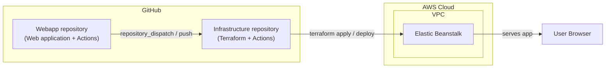

# Continuous Delivery with Terraform + GitHub + AWS (Elastic Beanstalk)

## Project Overview
This repository demonstrates Continuous Delivery (CD) to AWS Elastic Beanstalk using Terraform for infrastructure and GitHub Actions for automation. It’s a simple demo/POC prioritized for clarity over production hardening.

We recommend completing the work in two clear steps:
- Step 1: Get Terraform working with your AWS account (provision EB infrastructure and deploy the sample web app)
- Step 2: Get CD working with GitHub (trigger deployments from GitHub Actions)

Work through Step 1 first, verify it, then move on to Step 2.

## Architecture Overview
- **Source of webapp**: A GitHub repository provided by partner team.
- **Infrastructure as Code**: Terraform
- **Deployment Target**: AWS Elastic Beanstalk (single instance)
- **Application Type**: Static HTML web application (no database required)

### Architecture Diagram



## Simplifications (POC Only)
- Single instance deployment (no auto-scaling)
- No database/backend services
- No custom domain (use Elastic Beanstalk provided URL)
- No SSL/HTTPS required
- No staging environments
- Basic security configurations

## Technology Stack
- **Infrastructure**: Terraform (latest stable version)
- **Cloud Provider**: AWS
- **Compute**: AWS Elastic Beanstalk
- **Version Control**: GitHub

The result is to have an infrastructure GitHub repository orchestrates the deployment of a web application in a different 
GitHub repository.  That's a little complicated so to make it easier, we'll break this down into smaller steps.

# Step 1: Get Terraform working with your AWS account
## Terraform Infrastructure Components
You'll need to install these dependencies to test using your local environment:
- Terraform CLI
- AWS CLI (Optional: Terraform will use AWS CLI's credential configuration files in your user directory, or you'll need to environmental variables mentioned in next bullet)
- AWS credentials (AWS_ACCESS_KEY_ID, AWS_SECRET_ACCESS_KEY, AWS_REGION)

### 1. VPC (Virtual Private Cloud)
- **Resource Type**: `aws_vpc`
- **Resource Name**: `asgardeo_vpc`
- **Requirements**:
    - CIDR block: 10.0.0.0/16 (or whatever you'd like)
    - Enable DNS hostnames and DNS support
    - Public subnets in at least 2 availability zones (Beanstalk requirement)
    - Internet Gateway for public internet access
    - Route table with route to Internet Gateway

### 2. Security Group
- **Resource Type**: `aws_security_group`
- **Resource Name**: `asgardeo_security_group`
- **Requirements**:
    - Allow inbound HTTP traffic (port 80) from 0.0.0.0/0
    - Allow outbound traffic to all destinations (0.0.0.0/0)
    - Attached to Elastic Beanstalk environment

### 3. IAM Roles and Policies
- **Resource Types**: `aws_iam_role`, `aws_iam_instance_profile`, `aws_iam_role_policy_attachment`
- **Resource Names**: Use `asgardeo_*` prefix (e.g., `asgardeo_beanstalk_ec2_role`)
- **Requirements**:
    - EC2 instance profile for Beanstalk instances
    - Service role for Elastic Beanstalk
    - Attach AWS managed policies:
        - `AWSElasticBeanstalkWebTier`
        - `AWSElasticBeanstalkMulticontainerDocker` (if using Docker)
        - `AWSElasticBeanstalkWorkerTier` (if needed)

### 4. Elastic Beanstalk Application
- **Resource Type**: `aws_elastic_beanstalk_application`
- **Resource Name**: `asgardeo_application`
- **Requirements**:
    - Application name: "asgardeo-webapp-demo"
    - Description: "Demo application for Asgardeo"

### 5. Elastic Beanstalk Environment
- **Resource Type**: `aws_elastic_beanstalk_environment`
- **Resource Name**: `asgardeo_environment`
- **Requirements**:
    - Environment name: "asgardeo-webapp-demo-env"
    - Solution stack: Use latest supported platform for web application
        - For Node.js: "64bit Amazon Linux 2023 v6.x.x running Node.js 22"
    - Instance type: t3.micro (free tier eligible)
    - Single instance deployment (no load balancer for simplicity)
    - Configuration settings:
        - VPC ID
        - Subnet IDs (public subnets)
        - Security group
        - IAM instance profile
        - Environment type: SingleInstance

### 6. Application Version Deployment
- **Resource Type**: `aws_elastic_beanstalk_application_version`
- **Resource Name**: `asgardeo_app_version`
- **Requirements**:
    - S3 bucket to store application bundle (name: "asgardeo-webapp-artifacts" or similar)
    - Upload application bundle (.zip of webapp files)
    - Associate with Beanstalk application
    - Deploy to environment

## Terraform Variables

### Required Variables
- `aws_region` (string): us-east-1
- `project_name` (string): webapp-demo
- `environment` (string): Asgardeo-demo

### Optional Variables
- `instance_type` t3.micro
- `availability_zones` auto-detect 2 AZs

## Outputs
- `beanstalk_environment_url`: The URL of the deployed application. This is the URL to visit to see if the application deployed.
- `beanstalk_environment_id`: The environment ID
- `vpc_id`: The VPC ID created
- `application_version`: The deployed application version

## Testing What We Have So Far

### Manual Testing
1. Run `terraform apply` locally to provision infrastructure
2. Access the Beanstalk URL in a browser
3. Verify the homepage loads successfully
4. Check AWS Console for resource creation

## Cleanup/Destroy
- Provide script or documentation to run `terraform destroy`
- Ensure all AWS resources are removed to avoid charges
- S3 bucket with application versions may need manual cleanup

### Note about the webapp and service package
This setup requires .zip file containing a NodeJS application:
- no parent directory
- package.json with a "start" script
  DON'T PUT FILES INTO A SUBDIRECTORY OF THE ROOT DIRECTORY or Elastic Beanstalk will not find the start script.

## Test Sample Application
A minimal NodeJS application and service are in the repo for local testing.  

## Test Terraform works independent of Git
Prerequisites:
- Terraform installed
- AWS credentials in your environment (AWS_ACCESS_KEY_ID, AWS_SECRET_ACCESS_KEY, AWS_REGION)

Steps:
1. Manually create webapp.zip and service.zip in the repo root from directories webapp and service. (The zipped files must be in the root of the zip.  If they are zipped into a subdirectory, elastic beanstalk won't start the app because it can't find package.json.):
    2. (get rid of old zip packages if there are any) rm webapp.zip service.zip
    3. cd webapp /
    3. zip -r ../webapp.zip *
    4. cd ../service /
    5. zip -r ../service.zip *
2. cd to terraform directory
3. terraform init/plan/apply
   4. the plan will ask you for a sha (make up a random string) for the application version.  (In a git environment, it will use the git commit sha.)
4. go to the url displayed in the terraform output to see app working
5. terraform destroy

## Put Terraform state in S3
In Step 2, when we use terraform with Github actions, we'll need to have terraform state stored in S3 otherwise everytime 
the GitHub runners ephemeral infrastructure 
runs terraform, the state will be lost and the next call to terraform will run into errors as it will try to re-create 
infrastructure that is already created.

So first, let's setup the S3 bucket and dynamoDB (for locking) to store the terraform state, and then test this out with our local terraform install.

### Manual setup with AWS CLI (follow these instructions)
Well use AWS CLI commands to create a secure S3 bucket for Terraform state and a DynamoDB table for state locking, 
then configure Terraform to use them. (It turns out you *could* use terraform to set this up but it needs to be a 
seperate terraform plan and state from the one in this repo's terraform directory,
so I went with aws CLI to keep things clearly seperated and likely less confusing. If you've never used aws cli, then 
this is a gentle introduction of only a few steps. Visit with your favorite GPT to learn more about the instructions.
You could do all of this in the AWS console but the AWS script is the most succinct way to get across what needs to be done.)

Prerequisites:
- AWS CLI installed and authenticated to the target account
- Terraform installed locally
- You are in this repo’s root directory and have already created `webapp.zip` (see earlier section)

1) Set variables
```
REGION=us-east-1
ACCOUNT_ID=$(aws sts get-caller-identity --query Account --output text)
BUCKET="asgardeo-dev-${ACCOUNT_ID}-tfstate"   # change "dev" if desired
DDB_TABLE="terraform-locks"
STATE_KEY="global/terraform.tfstate"
```

2) Create the S3 bucket (region-aware)
Make a script or use the AWS CLI directly for you situation:
```
if [ "$REGION" = "us-east-1" ]; then
  aws s3api create-bucket --bucket "$BUCKET"
else
  aws s3api create-bucket --bucket "$BUCKET" \
    --create-bucket-configuration LocationConstraint="$REGION"
fi
```

3) Harden the bucket (block public access, enable versioning, enable encryption)
```
aws s3api put-public-access-block --bucket "$BUCKET" \
  --public-access-block-configuration BlockPublicAcls=true,IgnorePublicAcls=true,BlockPublicPolicy=true,RestrictPublicBuckets=true

aws s3api put-bucket-versioning --bucket "$BUCKET" --versioning-configuration Status=Enabled

aws s3api put-bucket-encryption --bucket "$BUCKET" --server-side-encryption-configuration '{
  "Rules": [{"ApplyServerSideEncryptionByDefault": {"SSEAlgorithm": "AES256"}}]
}'
```

#### (Optional) Deny insecure (non-TLS) access to the bucket
I didn't bother with this but I'm including it here in case you want to use this infrastructure in a production environment.
```
cat > /tmp/tfstate-bucket-policy.json <<JSON
{
  "Version": "2012-10-17",
  "Statement": [
    {
      "Sid": "DenyInsecureTransport",
      "Effect": "Deny",
      "Principal": "*",
      "Action": "s3:*",
      "Resource": [
        "arn:aws:s3:::${BUCKET}",
        "arn:aws:s3:::${BUCKET}/*"
      ],
      "Condition": { "Bool": { "aws:SecureTransport": "false" } }
    }
  ]
}
JSON
aws s3api put-bucket-policy --bucket "$BUCKET" --policy file:///tmp/tfstate-bucket-policy.json
```

4) Create a DynamoDB table for Terraform state locking
```
aws dynamodb create-table \
  --table-name "$DDB_TABLE" \
  --attribute-definitions AttributeName=LockID,AttributeType=S \
  --key-schema AttributeName=LockID,KeyType=HASH \
  --billing-mode PAY_PER_REQUEST
  
aws dynamodb wait table-exists --table-name "$DDB_TABLE"
```

5) Initialize Terraform to use the S3 backend and migrate local state
We will pass backend parameters via flags (no code changes required).
Edit main.tf and add the following so it can know about your intent to use the S3 backend.
You'll see that I used the bucket name, key, region, and dynamodb table name from the variables we set earlier.
```
terraform {
  backend "s3" {
    bucket = "asgardeo-dev-<aws account number>-tfstate"
    key    = "global/terraform.tfstate"
    region = "us-east-1"
    dynamodb_table = "terraform-locks"
    encrypt        = true
  }
}
```

Run a local test. You can migrate your local state to the S3 bucket when it prompts you to do so.
```
cd terraform
terraform init
```

> Optional: Another way to migrate state
> If the simple way above didn't cause the migration to happen, then you can run the following command to migrate the state.
> ```
> cd terraform
> terraform init \
>  -backend-config="bucket=${BUCKET}" \
>  -backend-config="key=${STATE_KEY}" \
>  -backend-config="region=${REGION}" \
>  -backend-config="dynamodb_table=${DDB_TABLE}" \
>  -backend-config="encrypt=true" \
>  -reconfigure
> ```
>
> The above command will configure the terraform backend to use the S3 bucket and DynamoDB table we created.  Then we
> migrate what is on the local drive to the S3 bucket with the `migrate-state` flag.  This is a one-time operation.  If you
> want to use the S3 backend in the future, you can run `terraform init` without the `migrate-state` flag.
> ```
> terraform init -migrate-state
> ```
> From here on, terraform will use the S3 bucket and DynamoDB table for state management. 

6) Verify it worked
One option is to see if the state file is in your s3 bucket.  Running the following will return and error if the state file isn't there.
```aws s3 ls s3://$BUCKET/$(dirname "$STATE_KEY")/```
You can run the following if you want to see the filename with your own eyes:
```aws s3 ls s3://```


Another option is to run the following to see if the Lock table is active. It will return "Active" if the lock is in place.
```aws dynamodb describe-table --table-name "$DDB_TABLE" --query 'Table.TableStatus'```

7) Test locking (optional but recommended)
- In terminal A: `terraform apply -auto-approve`
- While it runs, in terminal B: `terraform plan` → you should see an "Error acquiring the state lock" message (expected). Stop terminal B. When A finishes, the lock should be released.

###### WARNING: Only do this if you truly want to delete the backend and its data.
Eventually, you may want to get ride of the terraform state when you're finished trying out this infrastructure.
```
aws s3 rm s3://$BUCKET --recursive
aws s3api delete-bucket --bucket "$BUCKET"
aws dynamodb delete-table --table-name "$DDB_TABLE"
```

# Step 2: Get CD working with GitHub
When the web application code is changed in the webapp repository, the infrastructure repository should be notified and 
the infrastructure should be updated.

## CD Pipeline Requirements (GitHub Actions)

### Workflow Triggers
- Push to `main` branch
- Manual workflow dispatch (for testing)

### Terraform and GitHub Workflow Steps

## Workflow steps for the Infrastructure Repository's workflow:
1. **Package Application**: Checkout webapp repo, create .zip bundle of webapp files
2. **Checkout Code**: Checkout the infrastructure repository
3. **Setup Terraform**: Install Terraform CLI
4. **Configure AWS Credentials**: Use GitHub Secrets for AWS access
5. **Terraform Init**: Initialize Terraform working directory
6. **Terraform Plan**: Preview infrastructure changes
7. **Terraform Apply**: Apply infrastructure changes (auto-approve for POC)
8. **Output URL**: Display Elastic Beanstalk environment URL
9. **Health Check**: Verify application is accessible (curl the homepage)

## Workflow steps for the Webapp Repository's workflow:
1. **Trigger Infrastructure Deployment**: Trigger infrastructure deployment workflow when there is a code change

### Setup and test GitHub Actions for Infrastructure Repository and Webapp Repository
A workflow is provided to run the same test using your AWS credentials and region.  This will suss out environmental 
problems such as IAM permissions, GitHub secrets, etc. Once that works, we'll move on to getting the repository dispatch 
workflow working. 

- Workflow: .github/workflows/test-deploy.yml
- Triggers: workflow_dispatch (manual)
- Required GitHub Secrets:
    - AWS_ACCESS_KEY_ID
    - AWS_SECRET_ACCESS_KEY
    - (Optional) AWS_REGION if not provided as an input

How to run:
1. Push this repository to GitHub and configure the secrets above.
2. In the Actions tab, run "Test Terraform Deploy".
3. Inputs:
    - aws_region: defaults to us-east-1
    - skip_destroy: default false (will destroy after test)
4. The job will provision, wait for HTTP 200, and destroy by default.

##### Required GitHub Secrets
Filling the below bullets out is the goal but to do so, you'll need to create the AWS user for GitHub Actions, 
create an access key for the user, as explained in the next section.
- `AWS_ACCESS_KEY_ID`: <AWS IAM user access key>
- `AWS_SECRET_ACCESS_KEY`: <AWS IAM user secret key>
- `AWS_REGION`: us-east-1
- `AWS_ACCOUNT_ID`: <AWS account ID>
- `TF_STATE_BUCKET` = asgardeo-dev-<AWS account ID>-tfstate
- `TF_LOCK_TABLE` = terraform-locks

XXX> stopped here: next steps 
~~Add the additional secrets,
change the gitactions to do the below.~~
- testing manual workflow dispatch
- update all the calls to terraform in test_deploy.sh to use the same backend config: terraform -chdir="${TF_DIR}" init "${INIT_FLAGS[@]}" 1>/dev/null
XXXX

In the workflow step that runs `terraform init`, pass the same backend flags:
```
terraform init \
-backend-config="bucket=${{ secrets.TF_STATE_BUCKET }}" \
-backend-config="key=global/terraform.tfstate" \
-backend-config="region=${{ env.AWS_REGION }}" \
-backend-config="dynamodb_table=${{ secrets.TF_LOCK_TABLE }}" \
-backend-config="encrypt=true" \
-reconfigure
```
XXXX

###### Steps to setup a user for GitHub Actions
We'll need to do the following steps to create a secure user for GitHub Actions to use:
1) create user and make a member of a group
2) create policy and attach policy to group

**Note**: You could "inline" the policy directly to the group. I chose to create a policy and attach it to the group as somehow I lost the inline policy the last time I did this.  (If the group is removed then the policy is lost, and maybe that's what happened.)

*Create a user and group*
I vaguely did the steps below. What I did was created user github-deploy.  During that process, I added that user to a new group called asgardeo-admin, and created a policy for the group.
To create a policy for the group, I copy/pasted main.tf into a GPT and discussed what kind of policy file it would need.  It told me of the
permissions needed.  I then pasted that into AWS console for the policy. Tip: You can use the 
visualize policy editor to see what the policy looks like at a higher level than reading through the policy's json format.

1. Create an IAM user 
2. Add the user to a group (AWS console lets you create groups in the "create user" workflow). Mine was called asgardeo-admin since the policies will be segmented to that products resources.
3. Create programmatic access for that user: https://docs.aws.amazon.com/IAM/latest/UserGuide/id_credentials_access-keys.html (I later found the "create access key" link on the user's summary page in IAM.)
4. Create a new access key for the user
5. Store the access key ID and secret key in GitHub Secrets, and the other secrets mentioned in the previous section.

*Create a policy and attach to group*
A Customer Managed Policy is your own reusable permission set.
You create it once, maintain it centrally, and then attach it to multiple users, groups, or roles.  Also it might take a few tries to get the
policy right and you'd hate to have it deleted because you removed the role.

🧱 Example: Terraform Deployment Policy
In the AWS Console:
Go to IAM → Policies → Create policy
Choose the JSON tab
Paste in something like the following (or ask your GPT for a policy).

> Sidebar: the best way to create a policy file for terraform.
> The easiest way to finish this quickly is to give the policy Adim privliges to all resources.
> 
> The most *secure way* is to create a policy that only allows terraform to create resources it needs.
> Here is a process for doing that:
> 1. Create a policy that allows terraform to create all resources it needs (the easiest way).
> 2. Look at XYZ to get a list of resources it needs. Then create a policy that allows terraform to create only those resources.  <XXX explain this better
> 3. Attach the policy created in step 1 to the user created in step 2.

Note: The policy below could be scoped to more specific resources through the use of wildcarding.  Maybe I'll try that later as there are some details that need to be addressed to do that:
* Resource: "*" is used for IAM, EC2, and Elastic Beanstalk because Terraform creates resources with dynamic names and ARNs — a fully scoped ARN is difficult to know in advance.
* S3 permissions should be further restricted to only the bucket Terraform will create.  Since the bucket name is dynamically generated (asgardeo-artifacts-...), a wildcard is needed.
* This demo isn't using load balancing so permissions to manage an ELB isn't in the below.

```json
{
  "Version": "2012-10-17",
  "Statement": [
    {
      "Sid": "EC2Networking",
      "Effect": "Allow",
      "Action": [
        "ec2:CreateVpc",
        "ec2:DescribeVpcs",
        "ec2:DeleteVpc",
        "ec2:CreateSubnet",
        "ec2:Describe*",
        "ec2:ModifyInstance*",
        "ec2:DeleteSubnet",
        "ec2:CreateInternetGateway",
        "ec2:AttachInternetGateway",
        "ec2:DetachInternetGateway",
        "ec2:DeleteInternetGateway",
        "ec2:DeleteVpc",
        "ec2:DeleteSubnet",
        "ec2:DeleteRouteTable",
        "ec2:DeleteRoute",
        "ec2:DeleteNetworkAcl*",
        "ec2:CreateNetworkAcl*",
        "ec2:DeleteNatGateway",
        "ec2:CreateNatGateway",
        "ec2:ReleaseAddress",
        "ec2:AssociateAddress",
        "ec2:DisassociateAddress",
        "ec2:AllocateAddress",
        "ec2:AssociateRoute*",
        "ec2:DisassociateRoute*",
        "ec2:DeleteRoute*",
        "ec2:CreateRoute*",
        "ec2:AuthorizeSecurityGroup*",
        "ec2:RevokeSecurityGroup*",
        "ec2:DescribeAvailabilityZones",
        "ec2:CreateTags",
        "ec2:ModifyVpc*",
        "ec2:DeleteTag*",
        "tag:GetResources",
        "tag:GetTag*",
        "ec2:Describe*",
        "ec2:CreateVpc",
        "ec2:DeleteVpc",
        "ec2:ModifySubnetAttribute",
        "ec2:ReplaceRoute*",
        "ec2:ModifyNetwork*",
        "ec2:CreateSecurityGroup*",
        "ec2:DeleteSecurityGroup*",
        "ec2:ModifySecurityGroup*",
        "ec2:DeleteLaunchTemplate",
        "ec2:DeleteLaunchTemplate",
        "ec2:TerminateInstances",
        "ec2:RunInstances",
        "ec2:CreateLaunchTemplate",
        "ec2:DeleteLaunchTemplate"
      ],
      "Resource": "*"
    },
    {
      "Sid": "S3Buckets",
      "Effect": "Allow",
      "Action": [
        "s3:GetObject*",
        "s3:PutObject*",
        "s3:DeleteObject*",
        "s3:PutObject*",
        "s3:GetBucket*",
        "s3:DeleteBucket*",
        "s3:ListBucket*",
        "s3:GetAccelerateConfiguration",
        "s3:PutAccelerateConfiguration",
        "s3:GetLifecycleConfiguration",
        "s3:PutLifecycleConfiguration",
        "s3:GetReplicationConfiguration",
        "s3:PutReplicationConfiguration",
        "s3:ListBucketMultipartUploads",
        "s3:AbortMultipartUpload",
        "s3:ListMultipartUploadParts",
        "s3:PutBucket*",
        "s3:GetBucket*",
        "s3:DeleteBucket*",
        "s3:ListBucket*",
        "s3:CreateBucket*",
        "s3:GetEncryptionConfiguration",
        "s3:PutEncryptionConfiguration"
      ],
      "Resource": [
        "arn:aws:s3:::*"
      ]
    },
    {
      "Sid": "ElasticBeanstalk",
      "Effect": "Allow",
      "Action": [
        "elasticbeanstalk:*",
        "autoscaling:*",
        "elasticloadbalancing:*"
      ],
      "Resource": "*"
    },
    {
      "Sid": "CloudFormation",
      "Effect": "Allow",
      "Action": [
        "cloudformation:DescribeStacks",
        "cloudformation:GetTemplate",
        "cloudformation:CreateStack",
        "cloudformation:UpdateStack",
        "cloudformation:DeleteStack",
        "cloudformation:DescribeStack*",
        "cloudformation:ValidateTemplate",
        "cloudformation:SetStackPolicy",
        "cloudformation:CreateChangeSet",
        "cloudformation:DeleteChangeSet",
        "cloudformation:DescribeChangeSet",
        "cloudformation:ExecuteChangeSet",
        "cloudformation:ListStack*"
      ],
      "Resource": "*"
    },
    {
      "Sid": "CloudWatchLogs",
      "Effect": "Allow",
      "Action": [
        "cloudwatch:PutMetricData",
        "logs:CreateLogGroup",
        "logs:CreateLogStream",
        "logs:PutLogEvents",
        "logs:DescribeLogGroups",
        "logs:DescribeLogStreams",
        "cloudwatch:PutMetricAlarm",
        "cloudwatch:DeleteAlarms",
        "cloudwatch:DescribeAlarms"
      ],
      "Resource": "*"
    },
    {
      "Sid": "SNS",
      "Effect": "Allow",
      "Action": [
        "sns:CreateTopic",
        "sns:DeleteTopic",
        "sns:Subscribe",
        "sns:Unsubscribe",
        "sns:Publish"
      ],
      "Resource": "*"
    },
    {
      "Sid": "IAMRoles",
      "Effect": "Allow",
      "Action": [
        "iam:CreateRole",
        "iam:DeleteRole",
        "iam:DetachRolePolicy",
        "iam:AttachRolePolicy",
        "iam:PutRolePolicy",
        "iam:DeleteRolePolicy",
        "iam:PassRole",
        "iam:CreateInstanceProfile",
        "iam:DeleteInstanceProfile",
        "iam:AddRoleToInstanceProfile",
        "iam:RemoveRoleFromInstanceProfile",
        "iam:GetRole",
        "iam:GetInstanceProfile",
        "iam:ListRoles",
        "iam:ListInstanceProfiles",
        "iam:ListRolePolicies",
        "iam:ListAttachedRolePolicies",
        "iam:ListInstanceProfilesForRole",
        "iam:PassRole"
      ],
      "Resource": "*"
    },
    {
      "Sid": "DynamoDB",
      "Effect": "Allow",
      "Action": [
        "dynamodb:DescribeTable",
        "dynamodb:PutItem",
        "dynamodb:GetItem",
        "dynamodb:DeleteItem",
        "dynamodb:UpdateItem",
        "dynamodb:Scan"
      ],
      "Resource": "*"
    },
    {
      "Sid": "KeyManagementService",
      "Effect": "Allow",
      "Action": [
        "kms:Decrypt",
        "kms:Encrypt",
        "kms:GenerateDataKey",
        "kms:DescribeKey"
      ],
      "Resource": "*"
    },
    {
      "Sid": "MiscHelpers",
      "Effect": "Allow",
      "Action": [
        "sts:GetCallerIdentity"
      ],
      "Resource": "*"
    }
  ]
}
```

##### Test the Pipeline
Let's test that we've got so far:
* execute the github workflow
* GitHub can operate AWS 
* AWS credentials are setup and have the right permissions
* terraform can operate AWS

Let's run the test workflow:
1. In the Actions tab, run "Test Terraform Deploy".
2. Inputs:
    - aws_region: defaults to us-east-1
    - skip_destroy: default false (will destroy after test)
4. The job will provision, wait for HTTP 200, and destroy by default.

Count to 20 after clicking the "Run workflow" button, and you'll see the job run.  If you can create and destroy, and update an existing
resource, then you're good to go to the next step.

##### Setup GitHub Actions

**Step 1: Create GitHub Personal Access Token (PAT)**

1. In the infrastructure repository you've been working in, go to GitHub Settings → Developer settings → Personal access tokens → Tokens (classic)
2. Click "Generate new token" (classic)
3. Name it: `infrastructure-repo-dispatch`
4. Set expiration as needed
5. Select scopes:
   - ✅ `repo` (full control of private repositories)
6. Click "Generate token" and **copy the token** (you won't see it again)

**Step 2: Setup Webapp Repository**

In your **webapp repository** (the one maintained by the partner team):

1. **Add the PAT as a secret**:
   - Go to Settings → Secrets and variables → Actions
   - Click "New repository secret"
   - Name: `INFRA_REPO_PAT`
   - Value: Paste the PAT you created
   - Click "Add secret"

2. **Create workflow file**: `.github/workflows/notify-deploy.yml`
   ```yaml
   name: Notify Infrastructure Repo

   on:
     push:
       branches: [ "main" ]
     workflow_dispatch:

   jobs:
     notify:
       runs-on: ubuntu-latest
       steps:
         - name: Trigger infrastructure deployment
           uses: peter-evans/repository-dispatch@v2
           with:
             token: ${{ secrets.INFRA_REPO_PAT }}
             repository: YOUR_USERNAME/webapp-devops-aws  # ← Update this!
             event-type: webapp-updated
             client-payload: |
               {
                 "webapp_repo": "${{ github.repository }}",
                 "webapp_ref": "${{ github.ref }}",
                 "webapp_sha": "${{ github.sha }}"
               }
   ```

   **Important**: Replace `YOUR_USERNAME/webapp-devops-aws` with your actual infrastructure repository path (e.g., `myorg/webapp-devops-aws`)

**Step 3: Setup Infrastructure Repository**

In **this repository** (webapp-devops-aws):

1. **Ensure AWS secrets are configured**:
   - Go to Settings → Secrets and variables → Actions
   - Verify these secrets exist:
     - `AWS_ACCESS_KEY_ID`
     - `AWS_SECRET_ACCESS_KEY`
     - `AWS_REGION` (optional, defaults to us-east-1)

2. **Deployment workflow**: See the actual workflow file at `.github/workflows/deploy-from-web.yml` (already present in this repo).

   - Triggers: `repository_dispatch` (type `webapp-updated`) and manual `workflow_dispatch` with inputs `webapp_repo` and `webapp_ref`.
   - For details, open the file in this repository: `.github/workflows/deploy-from-web.yml`.

**Step 4: Test the Pipeline**

**Manual Test (Recommended First)**:
1. Go to your infrastructure repo → Actions tab
2. Select "Deploy from Webapp Update" workflow
3. Click "Run workflow"
4. Enter your webapp repository (e.g., `yourorg/webapp-repo`)
5. Click "Run workflow" button
6. Watch it deploy!

**Automatic Test**:
1. Make a change to your webapp repository
2. Commit and push to the `main` branch
3. Watch the webapp repo's Actions tab - should see "Notify Infrastructure Repo" run
4. Then check infrastructure repo's Actions tab - should see "Deploy from Webapp Update" trigger automatically
5. Visit the Elastic Beanstalk URL to see your changes live!

# How Deployment Works

1. **Developer pushes to webapp repo's `main` branch**
2. **Webapp workflow** packages the app and sends a `repository_dispatch` event to infrastructure repo
3. **Infrastructure workflow** receives the event and:
   - Checks out the webapp code from the source repository
   - Packages it as `webapp.zip` (without parent directory - EB requirement)
   - Runs Terraform to ensure infrastructure exists
   - Uploads new version to S3
   - Creates new Elastic Beanstalk application version
   - Deploys to environment
   - Waits for deployment to complete
   - Runs health check

## Benefits of This Approach

- ✅ **Separation of Concerns**: Webapp developers don't need AWS or Terraform knowledge
- ✅ **Automatic Deployments**: Push to main = automatic deploy
- ✅ **Audit Trail**: Full deployment history in GitHub Actions
- ✅ **Rollback Capability**: Can manually trigger deployment of any previous commit
- ✅ **Security**: AWS credentials only stored in infrastructure repo
- ✅ **Flexibility**: Manual trigger option for deploying specific versions

Notes on costs and cleanup:
- If you skip destroy, ensure you run scripts/destroy.sh or terraform destroy in terraform/ afterward to avoid charges.
- S3 artifact buckets with versioning may retain versions; empty and delete as needed.

# Notes on items to followup on
- later I added in using the sha variable for naming the zip file. Go back and see if this strategy is compatible with:
  - run terraform manually on local machine. (I suspect this variable will be undefined in this case.)

# Troubleshooting

**Issue**: Repository dispatch doesn't trigger infrastructure deployment
- **Solution**: Verify the PAT has `repo` scope and hasn't expired
- **Solution**: Check the repository path in webapp workflow is correct
- **Solution**: Ensure webhook/dispatch isn't blocked by organization settings

**Issue**: "repository not found" error
- **Solution**: If webapp repo is private, the PAT needs access to both repos
- **Solution**: For cross-organization repos, ensure PAT has access to both orgs

**Issue**: Webapp package fails to start on Elastic Beanstalk
- **Solution**: Ensure `package.json` has a `start` script
- **Solution**: Verify files are zipped without parent directory (use `zip -r webapp.zip *` inside the webapp directory)
- **Solution**: Check Elastic Beanstalk logs in AWS Console

**Issue**: Deployment workflow can't checkout webapp repo
- **Solution**: If webapp is private, add PAT to infrastructure repo secrets as `WEBAPP_REPO_TOKEN` and use it in checkout step

**Issue**: Github action gets "Error: Error acquiring the state lock"
- **Solution**: Congratulations! You've got terraform connecting shared state in AWS! So you're almost there. You need to adjust the policy/permissions that it mentions needing. (In this case see PutItem and GetItem in the error message below.)
[test-deploy] Running terraform plan...
╷
│ Error: Error acquiring the state lock
│
│ Error message: operation error DynamoDB: PutItem, https response error
│ StatusCode: 400, RequestID:
│ T1QJ0BB12M0HKAK1OT271M6NM3VV4KQNSO5AEMVJF66Q9ASUAAJG, api error
│ AccessDeniedException: User: arn:aws:iam::905418390803:user/github-deploy
│ is not authorized to perform: **dynamodb:PutItem** on resource:
│ arn:aws:dynamodb:***:905418390803:table/*** because no
│ identity-based policy allows the dynamodb:PutItem action
│ Unable to retrieve item from DynamoDB table "***": operation
│ error DynamoDB: GetItem, https response error StatusCode: 400, RequestID:
│ 11F47F6GGTL6G4UURMPVRG5A9RVV4KQNSO5AEMVJF66Q9ASUAAJG, api error
│ AccessDeniedException: User: arn:aws:iam::905418390803:user/github-deploy
│ is not authorized to perform: **dynamodb:GetItem** on resource:
│ arn:aws:dynamodb:***:905418390803:table/*** because no
│ identity-based policy allows the dynamodb:GetItem action
│

---
# Resources

## Further Reading (CD-focused)

- Repository Dispatch (short video): https://youtu.be/Sb_zLeHEVqQ
- Another Repostitory Dispatch (short video): https://www.youtube.com/watch?v=-xrFNFby7hc
- Repository dispatch action: https://github.com/peter-evans/repository-dispatch
- GitHub Actions events reference (workflow_dispatch, repository_dispatch): https://docs.github.com/actions/using-workflows/events-that-trigger-workflows
- AWS Elastic Beanstalk docs: https://docs.aws.amazon.com/elasticbeanstalk/
- Terraform AWS provider (Elastic Beanstalk): https://registry.terraform.io/providers/hashicorp/aws/latest/docs/resources/elastic_beanstalk_environment
- Terraform Learn (AWS): https://learn.hashicorp.com/collections/terraform/aws-get-started
- GitHub Actions: https://docs.github.com/en/actions/learn-github-actions/troubleshooting-github-actions
- Elastic Beanstalk: https://docs.aws.amazon.com/elasticbeanstalk/latest/dg/troubleshooting.html
- Terraform debugging: https://developer.hashicorp.com/terraform/internals/debugging

### Quick Reference

- Repository Dispatch: Trigger a workflow in another repo via API
- Workflow Dispatch: Manually run a workflow from the GitHub UI
- PAT: Personal Access Token used to authenticate cross-repo dispatch
- EB packaging tip: Zip the app contents without a parent folder; ensure `package.json` has a `start` script
- Cleanup: Destroy Terraform resources when finished to avoid charges