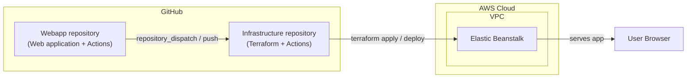

# Continuous Delivery demo: Terraform + GitHub + AWS (Elastic Beanstalk)

## Project Overview
This repository demonstrates Continuous Delivery (CD) to AWS Elastic Beanstalk using Terraform for infrastructure and GitHub Actions for automation. It’s a simple demo/POC prioritized for clarity over production hardening.

We recommend completing the work in two clear steps:
- Step 1: Get Terraform working with your AWS account (provision EB infrastructure and deploy the sample web app)
- Step 2: Get CD working with GitHub (trigger deployments from GitHub Actions)

Work through Step 1 first, verify it, then move on to Step 2.

## Architecture Overview
- **Source of webapp**: A GitHub repository provided by partner team.
- **Infrastructure as Code**: Terraform
- **Deployment Target**: AWS Elastic Beanstalk (single instance)
- **Application Type**: Static HTML web application (no database required)

### Architecture Diagram



## Simplifications (POC Only)
- Single instance deployment (no auto-scaling)
- No database/backend services
- No custom domain (use Elastic Beanstalk provided URL)
- No SSL/HTTPS required
- No staging environments
- Basic security configurations

## Technology Stack
- **Infrastructure**: Terraform (latest stable version)
- **Cloud Provider**: AWS
- **Compute**: AWS Elastic Beanstalk
- **Version Control**: GitHub

The result is to have an infrastructure GitHub repository orchestrates the deployment of a web application in a different 
GitHub repository.  That's a little complicated so to make it easier, we'll break this down into smaller steps.

# Step 1: Get Terraform working with your AWS account
## Terraform Infrastructure Components
You'll need to install these dependencies to test using your local environment:
- Terraform CLI
- AWS CLI

### 1. VPC (Virtual Private Cloud)
- **Resource Type**: `aws_vpc`
- **Resource Name**: `asgardeo_vpc` (or similar)
- **Requirements**:
    - CIDR block: 10.0.0.0/16
    - Enable DNS hostnames and DNS support
    - Public subnets in at least 2 availability zones (Beanstalk requirement)
    - Internet Gateway for public internet access
    - Route table with route to Internet Gateway

### 2. Security Group
- **Resource Type**: `aws_security_group`
- **Resource Name**: `asgardeo_security_group` (or similar)
- **Requirements**:
    - Allow inbound HTTP traffic (port 80) from 0.0.0.0/0
    - Allow outbound traffic to all destinations (0.0.0.0/0)
    - Attached to Elastic Beanstalk environment

### 3. IAM Roles and Policies
- **Resource Types**: `aws_iam_role`, `aws_iam_instance_profile`, `aws_iam_role_policy_attachment`
- **Resource Names**: Use `asgardeo_*` prefix (e.g., `asgardeo_beanstalk_ec2_role`)
- **Requirements**:
    - EC2 instance profile for Beanstalk instances
    - Service role for Elastic Beanstalk
    - Attach AWS managed policies:
        - `AWSElasticBeanstalkWebTier`
        - `AWSElasticBeanstalkMulticontainerDocker` (if using Docker)
        - `AWSElasticBeanstalkWorkerTier` (if needed)

### 4. Elastic Beanstalk Application
- **Resource Type**: `aws_elastic_beanstalk_application`
- **Resource Name**: `asgardeo_application`
- **Requirements**:
    - Application name: "asgardeo-webapp-demo"
    - Description: "Demo application for Asgardeo"

### 5. Elastic Beanstalk Environment
- **Resource Type**: `aws_elastic_beanstalk_environment`
- **Resource Name**: `asgardeo_environment`
- **Requirements**:
    - Environment name: "asgardeo-webapp-demo-env"
    - Solution stack: Use latest supported platform for web application
        - For Node.js: "64bit Amazon Linux 2023 v6.x.x running Node.js 22"
    - Instance type: t3.micro (free tier eligible)
    - Single instance deployment (no load balancer for simplicity)
    - Configuration settings:
        - VPC ID
        - Subnet IDs (public subnets)
        - Security group
        - IAM instance profile
        - Environment type: SingleInstance

### 6. Application Version Deployment
- **Resource Type**: `aws_elastic_beanstalk_application_version`
- **Resource Name**: `asgardeo_app_version`
- **Requirements**:
    - S3 bucket to store application bundle (name: "asgardeo-webapp-artifacts" or similar)
    - Upload application bundle (.zip of webapp files)
    - Associate with Beanstalk application
    - Deploy to environment

## Terraform Variables

### Required Variables
- `aws_region` (string): us-east-1
- `project_name` (string): webapp-demo
- `environment` (string): Asgardeo-demo

### Optional Variables
- `instance_type` t3.micro
- `availability_zones` auto-detect 2 AZs

## Outputs
- `beanstalk_environment_url`: The URL of the deployed application. This is the URL to visit to see if the application deployed.
- `beanstalk_environment_id`: The environment ID
- `vpc_id`: The VPC ID created
- `application_version`: The deployed application version

## Testing Requirements

### Manual Testing
1. Run `terraform apply` locally to provision infrastructure
2. Access the Beanstalk URL in a browser
3. Verify the homepage loads successfully
4. Check AWS Console for resource creation

## Cleanup/Destroy
- Provide script or documentation to run `terraform destroy`
- Ensure all AWS resources are removed to avoid charges
- S3 bucket with application versions may need manual cleanup

### Note about web app package
This setup requires .zip file containing a NodeJS application:
- no parent directory
- package.json with a "start" script
  DON'T PUT FILES INTO A SUBDIRECTORY OF THE ROOT DIRECTORY or Elastic Beanstalk will not find the start script.

## Test Sample Application
Include a minimal NodeJS and an "index.html` for initial testing:

## Test Terraform works independant of Git
Prerequisites:
- Terraform installed
- AWS credentials in your environment (AWS_ACCESS_KEY_ID, AWS_SECRET_ACCESS_KEY, AWS_REGION)

Steps:
1. zip files in webapp directory and put in parent directory (don't put web app files into a subdirectory or elastic beanstalk won't start the app):
    2. (get rid of old webapp.zip if there is one) rm webapp.zip
    3. cd webapp /
    3. zip -r ../webapp.zip *
2. cd to terraform directory
3. terraform init/plan/apply
4. go to the url displayed in the terraform output to see app working
5. terraform destroy

# Step 2: Get CD working with GitHub
When the web application code is changed in the webapp repository, the infrastructure repository should be notified and the infrastructure should be updated.

## CD Pipeline Requirements (GitHub Actions)

### Workflow Triggers
- Push to `main` branch
- Manual workflow dispatch (for testing)

### Terraform and GitHub Workflow Steps
XXX consider adjusting the below to reflect the different systems doing what.

1. **Checkout Code**: Checkout the repository
2. **Setup Terraform**: Install Terraform CLI
3. **Configure AWS Credentials**: Use GitHub Secrets for AWS access
4. **Terraform Init**: Initialize Terraform working directory
5. **Terraform Plan**: Preview infrastructure changes
6. **Terraform Apply**: Apply infrastructure changes (auto-approve for POC)
7. **Package Application**: Create .zip bundle of webapp files
8. **Upload to S3**: Upload application bundle to S3
9. **Deploy to Beanstalk**: Create/update application version and deploy
10. **Output URL**: Display Elastic Beanstalk environment URL
11. **Health Check**: Verify application is accessible (curl the homepage)

## Required GitHub Secrets
- `AWS_ACCESS_KEY_ID`: AWS IAM user access key
- `AWS_SECRET_ACCESS_KEY`: AWS IAM user secret key
- `AWS_REGION`: us-east-1
- `AWS_ACCOUNT_ID`: AWS account ID (optional, for S3 bucket naming)

#### Setup and test GitHub Actions on Infrastructure Repository
A workflow is provided to run the same test using your AWS credentials and region.

- Workflow: .github/workflows/test-deploy.yml
- Triggers: workflow_dispatch (manual)
- Required GitHub Secrets:
    - AWS_ACCESS_KEY_ID
    - AWS_SECRET_ACCESS_KEY
    - (Optional) AWS_REGION if not provided as an input

How to run:
1. Push this repository to GitHub and configure the secrets above.
2. In the Actions tab, run "Test Terraform Deploy".
3. Inputs:
    - aws_region: defaults to us-east-1
    - skip_destroy: default false (will destroy after test)
4. The job will provision, wait for HTTP 200, and destroy by default.

##### Setup GitHub Actions

**Step 1: Create GitHub Personal Access Token (PAT)**

1. Go to GitHub Settings → Developer settings → Personal access tokens → Tokens (classic)
2. Click "Generate new token" (classic)
3. Name it: `infrastructure-repo-dispatch`
4. Set expiration as needed
5. Select scopes:
   - ✅ `repo` (full control of private repositories)
6. Click "Generate token" and **copy the token** (you won't see it again)

**Step 2: Setup Webapp Repository**

In your **webapp repository** (the one maintained by the partner team):

1. **Add the PAT as a secret**:
   - Go to Settings → Secrets and variables → Actions
   - Click "New repository secret"
   - Name: `INFRA_REPO_PAT`
   - Value: Paste the PAT you created
   - Click "Add secret"

2. **Create workflow file**: `.github/workflows/notify-deploy.yml`
   ```yaml
   name: Notify Infrastructure Repo

   on:
     push:
       branches: [ "main" ]
     workflow_dispatch:

   jobs:
     notify:
       runs-on: ubuntu-latest
       steps:
         - name: Checkout webapp code
           uses: actions/checkout@v4

         - name: Trigger infrastructure deployment
           uses: peter-evans/repository-dispatch@v2
           with:
             token: ${{ secrets.INFRA_REPO_PAT }}
             repository: YOUR_USERNAME/webapp-devops-aws  # ← Update this!
             event-type: webapp-updated
             client-payload: |
               {
                 "webapp_repo": "${{ github.repository }}",
                 "webapp_ref": "${{ github.ref }}",
                 "webapp_sha": "${{ github.sha }}"
               }
   ```

   **Important**: Replace `YOUR_USERNAME/webapp-devops-aws` with your actual infrastructure repository path (e.g., `myorg/webapp-devops-aws`)

**Step 3: Setup Infrastructure Repository**

In **this repository** (webapp-devops-aws):

1. **Ensure AWS secrets are configured**:
   - Go to Settings → Secrets and variables → Actions
   - Verify these secrets exist:
     - `AWS_ACCESS_KEY_ID`
     - `AWS_SECRET_ACCESS_KEY`
     - `AWS_REGION` (optional, defaults to us-east-1)

2. **Create deployment workflow**: `.github/workflows/deploy-from-webapp.yml`
   ```yaml
   name: Deploy from Webapp Update

   on:
     repository_dispatch:
       types: [webapp-updated]
     workflow_dispatch:
       inputs:
         webapp_repo:
           description: 'Webapp repository (format: owner/repo)'
           required: true
         webapp_ref:
           description: 'Branch/tag/commit to deploy'
           required: false
           default: 'main'

   env:
     AWS_REGION: ${{ secrets.AWS_REGION || 'us-east-1' }}
     APP_NAME: asgardeo-webapp-demo
     ENV_NAME: asgardeo-webapp-demo-env

   jobs:
     deploy:
       runs-on: ubuntu-latest
       steps:
         - name: Checkout infrastructure repo
           uses: actions/checkout@v4

         - name: Setup Terraform
           uses: hashicorp/setup-terraform@v3
           with:
             terraform_wrapper: false

         - name: Configure AWS credentials
           uses: aws-actions/configure-aws-credentials@v4
           with:
             aws-access-key-id: ${{ secrets.AWS_ACCESS_KEY_ID }}
             aws-secret-access-key: ${{ secrets.AWS_SECRET_ACCESS_KEY }}
             aws-region: ${{ env.AWS_REGION }}

         - name: Determine webapp source
           id: webapp_source
           run: |
             if [ "${{ github.event_name }}" == "repository_dispatch" ]; then
               echo "repo=${{ github.event.client_payload.webapp_repo }}" >> $GITHUB_OUTPUT
               echo "ref=${{ github.event.client_payload.webapp_ref }}" >> $GITHUB_OUTPUT
               echo "sha=${{ github.event.client_payload.webapp_sha }}" >> $GITHUB_OUTPUT
             else
               echo "repo=${{ inputs.webapp_repo }}" >> $GITHUB_OUTPUT
               echo "ref=${{ inputs.webapp_ref || 'main' }}" >> $GITHUB_OUTPUT
               echo "sha=manual" >> $GITHUB_OUTPUT
             fi

         - name: Checkout webapp repository
           uses: actions/checkout@v4
           with:
             repository: ${{ steps.webapp_source.outputs.repo }}
             ref: ${{ steps.webapp_source.outputs.ref }}
             path: webapp-source
             token: ${{ secrets.GITHUB_TOKEN }}

         - name: Package webapp
           run: |
             cd webapp-source
             rm -f ../webapp.zip
             # Package without parent directory (EB requirement)
             zip -r ../webapp.zip * -x "*.git*" -x "node_modules/*" -x ".github/*" -x "*.md"
             cd ..
             ls -lh webapp.zip
             echo "Packaged webapp from SHA: ${{ steps.webapp_source.outputs.sha }}"

         - name: Terraform Init
           working-directory: ./terraform
           run: terraform init -input=false

         - name: Terraform Plan
           working-directory: ./terraform
           run: terraform plan -input=false -out=tfplan

         - name: Terraform Apply
           working-directory: ./terraform
           run: terraform apply -input=false -auto-approve tfplan

         - name: Read Terraform outputs
           id: tf_outputs
           working-directory: ./terraform
           shell: bash
           run: |
             echo "bucket=$(terraform output -raw artifacts_bucket_name)" >> $GITHUB_OUTPUT
             echo "url=$(terraform output -raw beanstalk_environment_url)" >> $GITHUB_OUTPUT

         - name: Upload bundle to S3
           env:
             BUCKET: ${{ steps.tf_outputs.outputs.bucket }}
           run: |
             KEY="webapp-${{ steps.webapp_source.outputs.sha }}-$(date +%s).zip"
             echo "Uploading to S3://${BUCKET}/${KEY}"
             aws s3 cp webapp.zip s3://$BUCKET/$KEY --region ${{ env.AWS_REGION }}
             echo "s3_key=$KEY" >> $GITHUB_ENV

         - name: Create application version
           env:
             BUCKET: ${{ steps.tf_outputs.outputs.bucket }}
           run: |
             SHA_SHORT=$(echo "${{ steps.webapp_source.outputs.sha }}" | cut -c1-7)
             LABEL="webapp-${SHA_SHORT}-$(date +%s)"
             echo "Creating version: $LABEL"
             aws elasticbeanstalk create-application-version \
               --application-name "$APP_NAME" \
               --version-label "$LABEL" \
               --source-bundle S3Bucket=$BUCKET,S3Key=${s3_key} \
               --description "Deployed from ${{ steps.webapp_source.outputs.repo }} @ ${SHA_SHORT}" \
               --region ${{ env.AWS_REGION }}
             echo "version_label=$LABEL" >> $GITHUB_ENV

         - name: Deploy to Elastic Beanstalk
           run: |
             echo "Deploying version: $version_label"
             aws elasticbeanstalk update-environment \
               --environment-name "$ENV_NAME" \
               --version-label "$version_label" \
               --region ${{ env.AWS_REGION }}

         - name: Wait for deployment
           run: |
             echo "Waiting for environment to update (this may take 5-10 minutes)..."
             aws elasticbeanstalk wait environment-updated \
               --environment-names "$ENV_NAME" \
               --region ${{ env.AWS_REGION }} || echo "Wait timed out, check manually"

         - name: Health check
           run: |
             URL="${{ steps.tf_outputs.outputs.url }}"
             echo "Running health check on: $URL"
             for i in {1..30}; do
               echo "Attempt $i/30..."
               if curl -fsS "$URL" > /dev/null 2>&1; then
                 echo "✅ Health check passed!"
                 curl -i "$URL"
                 exit 0
               fi
               sleep 10
             done
             echo "❌ Health check failed after 5 minutes"
             curl -i "$URL" || true
             exit 1

         - name: Output deployment info
           if: always()
           run: |
             echo "### 🚀 Deployment Summary" >> $GITHUB_STEP_SUMMARY
             echo "" >> $GITHUB_STEP_SUMMARY
             echo "- **Environment URL**: ${{ steps.tf_outputs.outputs.url }}" >> $GITHUB_STEP_SUMMARY
             echo "- **Version Label**: $version_label" >> $GITHUB_STEP_SUMMARY
             echo "- **Webapp SHA**: ${{ steps.webapp_source.outputs.sha }}" >> $GITHUB_STEP_SUMMARY
             echo "- **Webapp Repo**: ${{ steps.webapp_source.outputs.repo }}" >> $GITHUB_STEP_SUMMARY
   ```

**Step 4: Test the Pipeline**

**Manual Test (Recommended First)**:
1. Go to your infrastructure repo → Actions tab
2. Select "Deploy from Webapp Update" workflow
3. Click "Run workflow"
4. Enter your webapp repository (e.g., `yourorg/webapp-repo`)
5. Click "Run workflow" button
6. Watch it deploy!

**Automatic Test**:
1. Make a change to your webapp repository
2. Commit and push to the `main` branch
3. Watch the webapp repo's Actions tab - should see "Notify Infrastructure Repo" run
4. Then check infrastructure repo's Actions tab - should see "Deploy from Webapp Update" trigger automatically
5. Visit the Elastic Beanstalk URL to see your changes live!

##### How It Works

1. **Developer pushes to webapp repo's `main` branch**
2. **Webapp workflow** packages the app and sends a `repository_dispatch` event to infrastructure repo
3. **Infrastructure workflow** receives the event and:
   - Checks out the webapp code from the source repository
   - Packages it as `webapp.zip` (without parent directory - EB requirement)
   - Runs Terraform to ensure infrastructure exists
   - Uploads new version to S3
   - Creates new Elastic Beanstalk application version
   - Deploys to environment
   - Waits for deployment to complete
   - Runs health check

##### Troubleshooting

**Issue**: Repository dispatch doesn't trigger infrastructure deployment
- **Solution**: Verify the PAT has `repo` scope and hasn't expired
- **Solution**: Check the repository path in webapp workflow is correct
- **Solution**: Ensure webhook/dispatch isn't blocked by organization settings

**Issue**: "repository not found" error
- **Solution**: If webapp repo is private, the PAT needs access to both repos
- **Solution**: For cross-organization repos, ensure PAT has access to both orgs

**Issue**: Webapp package fails to start on Elastic Beanstalk
- **Solution**: Ensure `package.json` has a `start` script
- **Solution**: Verify files are zipped without parent directory (use `zip -r webapp.zip *` inside the webapp directory)
- **Solution**: Check Elastic Beanstalk logs in AWS Console

**Issue**: Deployment workflow can't checkout webapp repo
- **Solution**: If webapp is private, add PAT to infrastructure repo secrets as `WEBAPP_REPO_TOKEN` and use it in checkout step

##### Benefits of This Approach

- ✅ **Separation of Concerns**: Webapp developers don't need AWS or Terraform knowledge
- ✅ **Automatic Deployments**: Push to main = automatic deploy
- ✅ **Audit Trail**: Full deployment history in GitHub Actions
- ✅ **Rollback Capability**: Can manually trigger deployment of any previous commit
- ✅ **Security**: AWS credentials only stored in infrastructure repo
- ✅ **Flexibility**: Manual trigger option for deploying specific versions

Notes on costs and cleanup:
- If you skip destroy, ensure you run scripts/destroy.sh or terraform destroy in terraform/ afterward to avoid charges.
- S3 artifact buckets with versioning may retain versions; empty and delete as needed.

---

## Further Reading (CD-focused)

- Repository dispatch action: https://github.com/peter-evans/repository-dispatch
- GitHub Actions events reference (workflow_dispatch, repository_dispatch): https://docs.github.com/actions/using-workflows/events-that-trigger-workflows
- AWS Elastic Beanstalk docs: https://docs.aws.amazon.com/elasticbeanstalk/
- Terraform AWS provider (Elastic Beanstalk): https://registry.terraform.io/providers/hashicorp/aws/latest/docs/resources/elastic_beanstalk_environment
- Terraform Learn (AWS): https://learn.hashicorp.com/collections/terraform/aws-get-started

### Quick Reference

- Repository Dispatch: Trigger a workflow in another repo via API
- Workflow Dispatch: Manually run a workflow from the GitHub UI
- PAT: Personal Access Token used to authenticate cross-repo dispatch
- EB packaging tip: Zip the app contents without a parent folder; ensure `package.json` has a `start` script
- Cleanup: Destroy Terraform resources when finished to avoid charges

Troubleshooting:
- GitHub Actions: https://docs.github.com/en/actions/learn-github-actions/troubleshooting-github-actions
- Elastic Beanstalk: https://docs.aws.amazon.com/elasticbeanstalk/latest/dg/troubleshooting.html
- Terraform debugging: https://developer.hashicorp.com/terraform/internals/debugging
